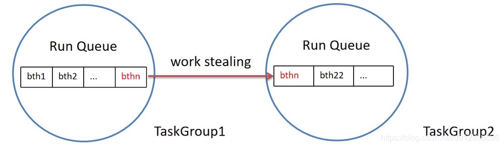

# bthread
## 调度
bthread 的机制核心是 work stealing，即pthread 之间可以偷 bthread来执行，一个bthread 被卡住不会影响其他 btrhead

* 因 bthread api 阻塞：会把当前的线程让给其他 btrhead执行
* 因 pthread api 阻塞：当前线程上待运行的 bthread会被其他空闲的线程偷过去执行

Context Switch: 人工调 boost 库函数做调度，bthread_make_fcontext 保存栈和寄存器到 buff，跳转当前程序运行的指针，再调用 bthread_jump_fcontext 跳回来，实现用户态上下文切换（协程汇编实现逻辑）

Scheduling: 一个worker（pthread）会有很多 bthread，每个worker通过一个TaskGroup管理，TaskGroup类中有 _rq 变量，维护一堆待执行的 bthread，基本调度为先进先出，特殊情况下，如bthread1 阻塞，那么 2、3、4 直至 n号 bthread就会被阻塞，那么空闲的worker 会偷剩余的bthread栈去跑，防止一个bthread阻塞使得整个 pthread阻塞
*这个看起来就是跳过阻塞的bthread，执行下一个*


简单理解，bthread执行用户指定的func过程存在两种情况：
* func执行完毕，此时去当前在跑的TaskGroup 中的 _rq 看是否有其他 bthread，如果有直接执行下一个，如果没有就去偷，偷不到则返回 pthread调度 bth，卡在 wait_task处
* func 中创建新 bthread 或 调用阻塞操作，立即进入新 bth，原bth 加入 _rq 尾部

*不太清楚这种偷是否合理，按skynet服务划分的理解，理论上应该要将一个服务的协程（func) 限制处于仅一个线程执行下，若被偷了func，对应多线程环境下是否会增加编程复杂性*

## TaskControl
### 数据结构
```cpp
base::atomic<size_t> _ngroup;       // TaskGroup 对象指针数组长度
TaskGroup** _groups;                // TaskGroup对象指针的数组

base::atomic<int> _concurrency;     // TC启动时的默认起的pthread数量，可以理解为bthread并发度数量，静态开关配置为9
std::vector<pthread_t> _workers;    // pthread线程标识符的数组，表示创建了多少个pthread worker线程，每个pthread worker线程应拥有一个线程私有的TaskGroup对象。

ParkingLot _pl[PARKING_LOT_NUM];    // ParkingLot类型的数组。ParkingLot对象用于bthread任务的等待-通知

siganl_task()：通知一部分parkinglot里的worker说有新bthread被创建出来啦，提醒worker去偷
steal_task()：遍历所有worker去偷，防止某一个thread在某一个TaskGroup一直得不到run被饿死的情况
```

### TaskGroup
```cpp
ContextualStack* _main_stack;       // TG单独持有的栈
bthread_t _main_tid;                // TG“调度线程”
WorkStealingQueue<bthread_t> _rq;   // 按序执行的bthread队列
RemoteTaskQueue _remote_rq;         // pthread下创建bthread会放入的队列
TaskMeta* _cur_meta;                // 当前正在执行的bthread的TaskMeta对象的地址
```


### 创建bthread的两种情况
* 本身在bthread内创建bthread，因为当前bthread肯定跑在某个worker中，所以就把新创建的btrhead加入该worker的rq_里，这样locality貌似好点

* 在pthread里创建 bthread，TaskControl随机挑选一个Worker（即TaskGroup），放到该worker的 _remote_rq 里

### 调度优先级
1. 基本调度，bthread在先进先出的rq队列逐个执行
2. 若本地 worker rq没有了则取 本地 _remote_rq 里 pop一个放到 rq里运行
3. 去其他worker的 _rq 偷
4. 去其他worker的 _remote_rq 里偷

* tip：worker 拿到tid如果无阻塞就一定会执行完，有阻塞就先从 rq拿掉放到队尾，执行下一个bthread
* tip：如果一个worker内有 pthread级别的阻塞，相当于这个workder就被阻塞，那么其他worker会偷走该worker内被阻塞的bthread


## Futex
futex 由一个内核态的队列 和 一个用户态的integer构成，有竞争时会放到等待队列，等待后面唤醒

整个操作主要用到了自旋锁来保护临界区

基于futex构造锁的时候一个典型的模式是通过对一个原子变量进行cas操作直接获取锁，如果竞争直接返回，有竞争则调用futex_wait

### ButexWaiter 等待队列节点
bthread的核心api都是兼容pthread的，所以butex也要支持pthread，所以也就有了ButexBthreadWaiter 和 ButexPthreadWaiter 两种用于阻塞后唤醒的 waiter

```cpp
struct ButexWaiter : public butil::LinkNode<ButexWaiter> {
    // tids of pthreads are 0
    bthread_t tid;

    // Erasing node from middle of LinkedList is thread-unsafe, we need
    // to hold its container's lock.
    butil::atomic<Butex*> container;
};

struct ButexBthreadWaiter : public ButexWaiter {
    TaskMeta* task_meta;
    TimerThread::TaskId sleep_id;
    WaiterState waiter_state;
    int expected_value;
    Butex* initial_butex;
    TaskControl* control;
    const timespec* abstime;
    bthread_tag_t tag;
};

// pthread_task or main_task allocates this structure on stack and queue it
// in Butex::waiters.
// 两层继承
// 1. butil::LinkNode
// 2. ButexWaiter
// 3. ButexPthreadWaiter
struct ButexPthreadWaiter : public ButexWaiter {
    butil::atomic<int> sig;
};

```

### Butex 
```cpp
struct BAIDU_CACHELINE_ALIGNMENT Butex {
    Butex() {}
    ~Butex() {}

    butil::atomic<int> value;
    ButexWaiterList waiters;
    FastPthreadMutex waiter_lock;
};
```
* waiters       等待队列
* waiter_lock   操作队列互斥锁

